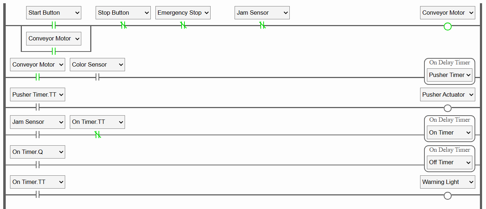

# Automated Conveyor Belt Sorting System

**Simulation Environment:** PLC Fiddle (no hardware required)

**Programming Language:** Ladder Logic

**1. Overview**
This projects simulates an automated conveyor belt sorting system controlled by a PLC
The system detects the color of boxes using a simulated sensor and activates a pusher actuator to sort red boxes into a designated bin.
The conveyor motor is controlled using Start, Stop, and Emergency Stop buttons, with safety interlocks and jam detection included.

**2. Objectives**
- Demonstrate ladder logic programming for industrial automation
- Implement motor ocntrol using latching logic
- Simulate sensor-based sorting logic wiht a timed actuator
- Integrate safety functions: Stop button, Emergency Stop, and Jam detection.

**3. I/O Mapping**

| Address | Type  | Description |
|---------|-------|-------------|
| I0      | Input  | Start Button (NO) |
| I1      | Input  | Stop Button (NC) |
| I2      | Input  | Emergency Stop (NC) |
| I3      | Input  | Color Sensor (1 = Red Box Detected) |
| I4      | Input  | Jam Sensor (NC for normal, opens on jam) |
| O1      | Output | Conveyor Motor
| O2      | Output | Pusher Actuator
| O3      | Output | Warning Light (Jam Sensor on) |
| T1      | Timer  | TON, 1-sec delay for pusher activation |
| T2      | Timer  | TON, toggle Fault Light on |
| T3      | Timer  | TOFF, toggle Fault Light off |

**4. Control Logic**

**Motor Control (Latch):**
- Press Start &rarr; Motor runs continuously via self-latching circuit
- Press Stop or E-Stop &rarr; Motor stops immediately, latch released.
- Jam detection also stops the motor

**Sorting Logic:**
- While motor is ON, if the color sensor detects red, start a TON timer for 1 second.
- Pusher actuator energizes for the timer duration, sorting the box
- Blue boxes pass without pusher activation

**5. Ladder Logic Diagram**

**6. Testing Procedure**

**1. ** Toggle Start ON then OFF &rarr; Motor stays running.
**2. ** Toggle Color Sensor ON for a moment &rarr; Pusher activates for 1 second, then retracts
**3. ** Toggle Jam Sensor ON &rarr; Motor stops immediately and flashing light comes on.
**4. ** Press Stop or E-Stop &rarr; Motor stops, pusher disabled.

**7. Results**

- Sucessful simulation of a conveyor sorting process with safety interlocks
- Demonstrated understanding of latching circuits, timer functions, and sensor-based control.

**8. Link to Simulation**

[PLC Fiddle Project](https://www.plcfiddle.com:/fiddles/68db4823-a15c-4575-ae76-710080def148)
